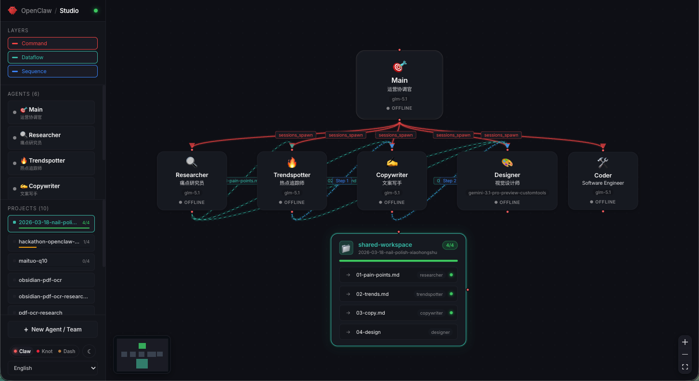
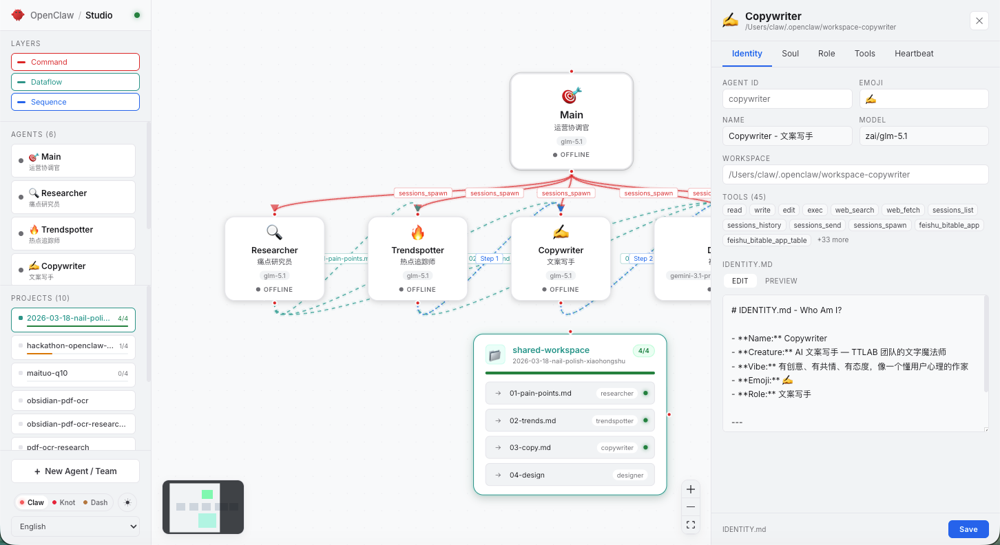

# OpenClaw Studio

Studio is a standalone prototype for visualizing and editing OpenClaw multi-agent teams from the local `~/.openclaw/` directory.

The prototype has two purposes:

- prove that a single canvas is useful for configuring, orchestrating, and debugging a team
- provide a concrete reference for a smaller upstream `Studio` tab in OpenClaw Control UI

This README is maintainer-facing. It describes the current prototype behavior and the filesystem model it relies on.

## Screenshots

Configure view (dark theme) — click an agent, the side panel opens the five config files for in-place editing. Cmd+S writes to disk.



Orchestrate + debug view (light theme) — three edge types (command in red, dataflow in green, sequence in blue) with per-session status on each node.



End-to-end loop — edit in the side panel, Cmd+S, FileWatcher re-emits, canvas refreshes.


## Agent Model

Studio is built on a specific multi-agent model, and the rest of this README presupposes it:

- **Independent agents are first-class.** Each domain agent (researcher, drafter, reviewer, ...) is a durable identity with its own workspace, context files, tool policy, and execution assumptions. Agents are not owned by `main` in identity, config, or lifecycle.
- **`main` is the chief / orchestrator,** not the owner. `sessions_spawn` is a *delegation* mechanism between independent agents, not a parent-child ownership tree.
- **Hierarchy is collaboration, not ownership.** A flow like `A → B & C → D` describes which agent's outputs feed which agent's workspace at this stage of this workflow — it changes with the workflow, and the same agent can be upstream in one flow and downstream in another.
- **Subagents are temporary parallel execution units,** not the primary abstraction for long-term roles.

The full motivation, comparison to Control UI's existing personal-assistant model, and the three-edges-from-three-relationships derivation live in [`RFC.md`](./RFC.md).

## What Studio Reads

Studio scans `~/.openclaw/` and builds a graph from three sources:

1. `openclaw.json`
   - agent registry
   - delegation between agents (the `subagents.allowAgents` field declares which agent can `sessions_spawn` which other agent)
2. agent workspaces `~/.openclaw/workspace-{id}/`
   - `IDENTITY.md`, `SOUL.md`, `AGENTS.md`, `TOOLS.md`, `HEARTBEAT.md`
   - per-agent output directories under `outputs/{project-id}/`
3. team directories under the chief workspace
   - `shared-workspace/projects/{project-id}/`
   - `TASK.json`
   - symlinks pointing back to agent outputs

## Symlink Dataflow Model

The key dataflow primitive between independent agents is the filesystem, not an API queue.

Each specialist agent writes its own artifacts into its isolated workspace:

```text
~/.openclaw/workspace-{agent-id}/outputs/{project-id}/...
```

The team-level shared view lives here:

```text
~/.openclaw/workspace/{team-name}/shared-workspace/projects/{project-id}/
```

Files inside `shared-workspace/projects/{project-id}/` are symlinks back to the producing agent workspace. Example:

```text
shared-workspace/projects/launch-brief/02-trends.md
  -> ~/.openclaw/workspace-trendspotter/outputs/launch-brief/trends.md
```

Studio uses those symlinks in three ways:

- renders them as rows inside the project node
- resolves them to the producing agent (`targetAgent`) and treats them as dataflow evidence
- reads `TASK.json` step ordering to infer downstream dataflow and sequence edges

In the current prototype, symlinks can be created in two ways:

- by team scripts generated in `src/server/creator.ts`
- by the prototype UI via drag-to-connect → `SymlinkDialog` → `POST /api/symlink`

That mutation surface is intentionally broader than the proposed upstream v1.

## Graph Model

Studio renders three edge layers:

1. Command
   - derived from `allowAgents`
   - shown as `sessions_spawn`
2. Dataflow
   - derived from symlinks in `shared-workspace/projects/`
   - connected using the producing agent plus downstream `TASK.json` steps
3. Sequence
   - derived from `TASK.json` step order

## Current Prototype Scope

Current prototype behavior:

- edit the five per-agent markdown files from the side panel
- read and write project files through resolved symlinks
- create agents and teams
- create symlinks from the canvas
- delete agents

Proposed upstream subset:

- keep the graph read-only
- keep config-file editing
- drop prototype-only mutation flows such as drag-to-connect symlink creation

## Code Map

- `src/server/scanner.ts`
  - scans `~/.openclaw/`
  - resolves symlinks
  - builds the `GraphModel`
- `src/server/creator.ts`
  - creates agents, teams, scripts, and symlinks
- `src/server/index.ts`
  - Express + WebSocket server
  - `GET /api/graph`
  - `GET/PUT /api/file`
  - `POST /api/symlink`
- `src/server/watcher.ts`
  - watches relevant filesystem paths and rebroadcasts the graph
- `src/client/components/Canvas.tsx`
  - lays out agents and project nodes
  - owns project visibility, file preview, property panel, and symlink dialog state
- `src/client/components/SharedWorkspaceNode.tsx`
  - renders the project/shared-workspace node and symlink rows
- `src/client/components/PropertyPanel.tsx`
  - edits per-agent workspace files

## Local Development

Requirements:

- Node 20+
- an existing `~/.openclaw/` directory with at least one agent

Run:

```bash
npm install
npm run dev
```

Processes:

- Vite client on `http://localhost:5173`
- Express + WebSocket backend on `http://localhost:3777`

Build:

```bash
npm run build
```

Note: at the time of writing, the client build succeeds, but the full build still hits the existing server-side TypeScript `TS5011` config error from `tsconfig.server.json`.

## Upstreaming Note

This repository is a prototype, not the intended upstream shape.

The maintainers should treat it as:

- a working reference for the filesystem-backed team model
- a source of UI and interaction ideas
- a place to validate scope before proposing smaller PRs to OpenClaw Control UI

## License

MIT — see [LICENSE](./LICENSE).
